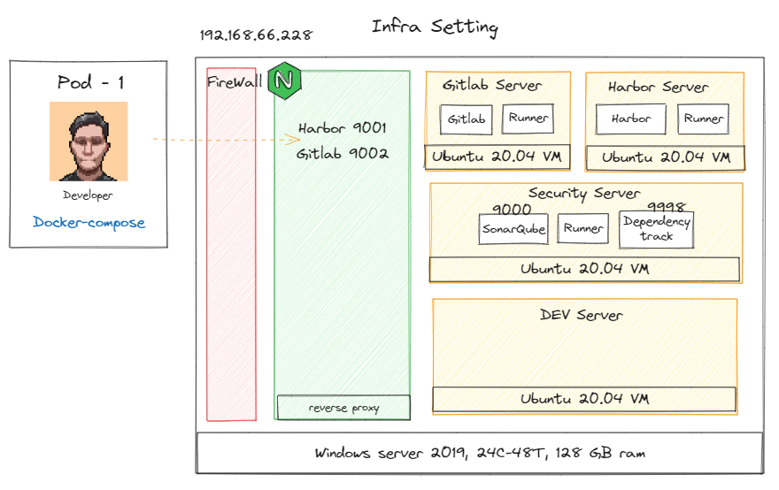

# S8 e-Banking Portal 

## Introduction

S8 e-Banking System is a web application that provides a banking portal for the customers of S8 Bank. It is a Spring Boot application that provides RESTful APIs for the e-Bank Application.

This System contains the following components:

* Bank Portal Backend (BFF): Spring Boot application that provides RESTful APIs for frontend applications, doing authentication and authorization (By Spring Security API), and communicating with other microservices.
* User-Services: Spring Boot application that provides RESTful APIs for user management, including user information, permissions and groups management.
* Adapter-Service: Spring Boot application that collects data from the Message Queue and stores it in the database.
* Transaction-Service: Spring Boot application that provides core functionalities for the e-Banking System.

The typology of the system is shown below:


The Project structure using:

* OpenJDK 17
* Spring Boot 3.0.10
* Spring Security 6 
* Maven 3.8.5
* H2 database for unit test
* MS SQL Server 2019
* Redis

---

## How to run the application

This system provided a docker-compose file to run the application. To run the application, please follow the steps below:

1. Install Docker and Docker Compose (Suggestions: Docker Desktop)
2. setup insecure registry for on-premise Harbor registry
3. Clone the config-repo
4. pull the mssql docker image with following command

```bash
docker run -e ACCEPT_EULA=Y -e MSSQL_PID="Developer" -e MSSQL_SA_PASSWORD="Demo1234" -e MSSQL_TCP_PORT=1433 -p 1433:1433 -d mcr.microsoft.com/mssql/server:2022-latest
```

5. login to Database with IDE that you prefer (e.g. DataGrip), create two databases:
   * SYNPULSE_USER_DB
   * SYNPULSE_TRANX_DB

6. dump the dummy data from data folder

7. Within the config-repo, inside docker-compose/synpulse-compose, using cmd to pull the docker images from the Harbor registry

```bash
docker-compose up -d
```

---

## Infrastructure



This system hosted in an on-premise environment. The infrastructure is shown above.

With 3 VM for Pipeline, 1 for Dev Env and Nginx used as a reverse proxy.

---

## PR flow

Initially, this project using Github flow, with only master and feature branch, the process is shown below:

1. Pull the latest master branch
2. Create a feature branch from master
3. Develop and commit changes to the feature branch
4. Pull the feature branch to the remote repository, review pipeline status and do the remediation if needed
5. Raise merge request from the feature branch to master
6. After merge to master, docker images can build with tag latest and push to the Harbor registry


--- 

## Project Development Status

### Project Management

Hosted in On-premise Gitlab, with the group name "synpulse8"


### Github flow

Initially, this project using Github flow, in further development, suggest using Gitflow.


### Pipeline

Currently, the pipeline trigger by push and merge, only trigger the security jobs.

And the manual tag will trigger both security and build jobs.


### SonarQube & Dependency-Track

SonarQube not allow internet user assist, can only login with remote desktop, can consider as VPN.


Basically, by setting the quality gate, the pipeline will fail if the quality gate is not passed.

Forcing the developer to do the remediation.


